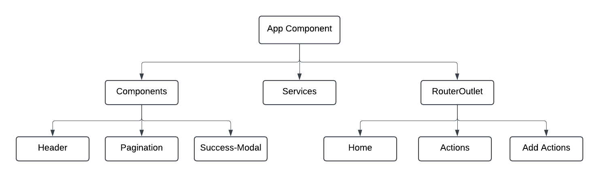

# SustainabilityTracker 

This tracker is a basic system to track and display sustainability actions. This project consists of two parts: the frontend and the backend. The frontend is built using Angular, and the backend is built using Node.js and Express.js. Together, they provide a platform for users to mangage and monitor their sustainability efforts.
1. Frontend:
    - List sustainability actions in a table
    - Add new sustainability action
2. Backend:
    - Add and fetch sustainability actions via API
    - JSON file storage for data persistence

This project was generated using [Angular CLI](https://github.com/angular/angular-cli) version 19.0.7.


## Working Demo Video
[Demo Video](https://drive.google.com/file/d/1jcnP34lMdCBkG9Y0A3ZF9NTkgCvFNVM8/view?usp=sharing) contains a run through of the website's basic features and layout.


## Prerequisits
- [Node.js](https://nodejs.org/) (version 22.x or higher)
- [npm](https://www.npmjs.com/) (Node Package Manager)
- [Angular CLI](https://angular.io/cli) (version 17.x or higher)
- [Express.js](https://expressjs.com/) (Backend)

## Usage
Clone the repository and navigate to repository:
```bash
git clone https://github.com/MinArchie/sustainability-tracker-project.git

cd sustainability-tracker-project
```

## Backend: Quick Start

### Installation 
Navigate to the backend folder:
```bash
cd sustainability-tracker-api
```

Install Backend Dependencies.
```bash
npm install
```

```npm install``` should automatically take care of installing any dependencies. 

Core Dependecies:
- ```express.js```
- ```joi``` (validator)
- ```cors``` (for allowing api to be used)
- ```nodemon``` (nodemon, optional for live-reloading).

### Running the Server
1. Start the server
    ```bash
    node index.js
    ```
    Use ```nodemon index.js``` if nodemon is installed.
   
    Server runs on ```localhost:3000``` by default, unless port is specifed by PATH.

    Ensure server is running before attempting to run the website.


## Frontend: Quick Start
1. Navigate to Frontend Folder
    ```bash
    cd frontend
    ```
2. Install Dependencies.
    ```bash
    npm install
    ```
    - All dependencies should be installed. Core Dependency is ```Bootstrap```


### Running the Application
```bash
ng serve --open
```

Once the server is running, open your browser and navigate to `http://localhost:4200/`. The application will automatically reload whenever you modify any of the source files.


## Running Unit Tests:
Run the following command to start:
```bash
cd frontend

npm run test
```
The files with ```.specs.ts``` extension hold the default tests

## Running Functional Tests for API Endpoints
Using the <b>Postman Desktop Application</b> or <b>VS Code Extension</b>, follow these steps to vefiy api endpoints:
- Start the backend server 
    ```bash
    cd sustainability-tracker-api

    node index.js
    ```
- Import [test collection](/functional_tests/Sustainability%20Tracker%20API%20Tests.postman_collection.json) (/functional_tests/)into Postman. 
- Run Collection


## Project Structure
### Backend
```
sustainability-tracker-api
├── index.js
├── data.json
├── package.json
```
- ```index.js```: Entry point for the backend application.
- ```data.json```: Stores sustainability actions.

### Frontend

```arduino
SUSTAINABILITY-TRACKER
├── public
├── src
    ├── app
        ├── actions
        ├── add-actions
        ├── home
        ├── model
        ├── services
        ├── components
            ├── header
            ├── pagination
            ├── success-modal
    ├── index.html
    ├── main.ts
    ├── styles.scss
```
- ```src/app/```: Contains the main application logic and components.
- ```src/app/model```: json data structure
- ```src/app/services```: routing 
- ```public```: assets (svg, images, etc)